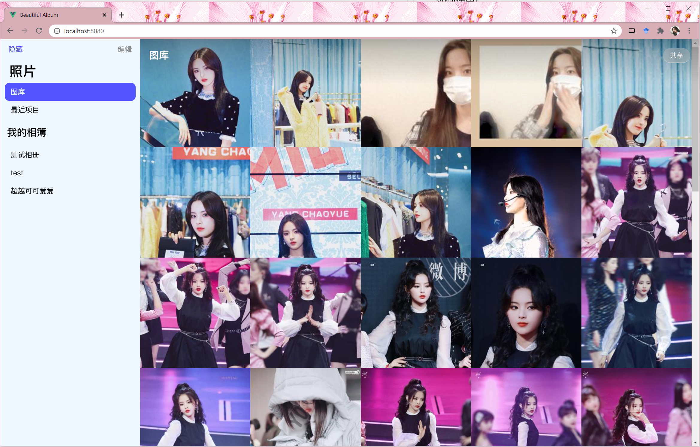
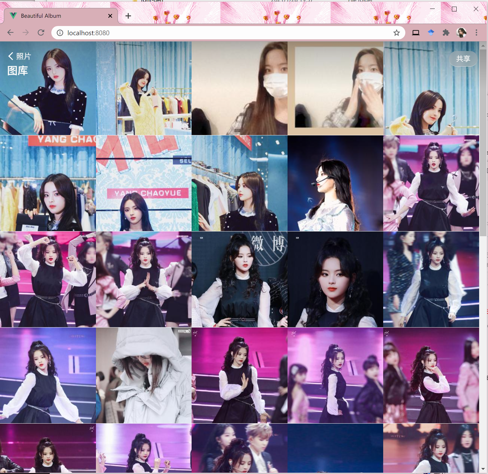
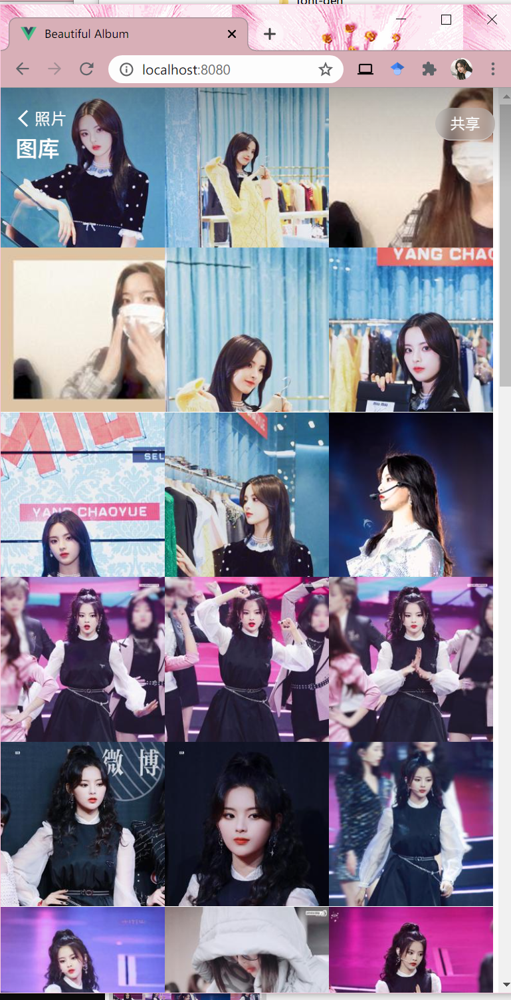

# Beautiful Album

## 简介
模仿iOS相册的纯静态响应式布局的在线相册程序。**以及超越妹妹真的太可爱啦！！！**

## 如何使用？
**首先，编译Web项目**

0. 安装依赖： `npm install`
1. 构建项目： `npm run build`，生成的代码在dist目录下。复制所有dist目录下的文件到nginx的web root根目录。

**然后生成图片缓存以及相关json文件**

0. 安装依赖：`pip3 install numpy pillow`
1. 在scripts目录下，新建一个albums目录，这个目录用来存放相册。
2. 在albums目录下新建目录，每一个目录都是一个相册，建议使用英语名，例如：`cutecy`。新建一个和之前的目录名同名的.txt文件可以自定义一个好看的名称，例如新建`cutecy.txt`，并在该文件中保存文本`超越妹妹可可爱爱`，会在相册的网页界面中显示后面TXT文本的内容。在每个相册的目录都可以放入任意的图片。
3. **运行 generate-jsons.py。**
4. **在nginx的web root根目录下新建一个api目录，并将albums、album-caches以及生成的所有json文件放入该目录。**

注意：之后每一次更新完照片以后，都需要重新执行上述3-4步骤。

---------

by Miyuki, 2020.1, Licensed under MIT license