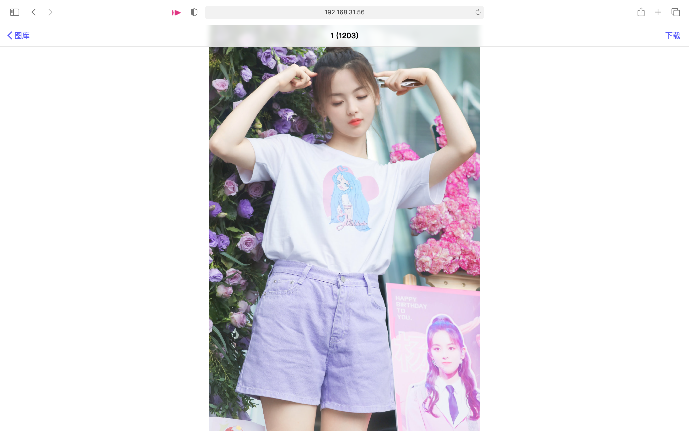

# Beautiful Album

## 简介
使用Vue编写的，iOS相册风格的，纯静态响应式布局的在线相册。

<a href="https://acane77.github.io/album-demo.html" STYLE="font-size: 18px">在线Demo</a> (密码为`secret`)

* 纯静态网页，运行时不需要任何后端程序和数据库，可存放在github.io。
* 支持多个相册，访问时支持密码保护


## 超越妹妹真的太可爱啦！！！





## 如何使用？


**首先，编译Web项目**

0. 安装依赖： `npm install`
1. 构建项目： `npm run build`，生成的代码在dist目录下。复制所有dist目录下的文件到nginx的web root根目录。

**然后生成图片缓存以及相关json文件**

0. 安装依赖：`pip3 install numpy pillow`
1. 在scripts目录下，新建一个`albums`目录，这个目录用来存放相册。
2. 在`album`目录下新建目录，每一个目录都是一个相册，建议使用英语名，例如：`cutecy`。
   新建一个和之前的目录名同名的.txt文件可以自定义一个好看的名称，
   例如新建`cutecy.txt`，并在该文件中保存文本作为显示在界面中的相册名（例如：`超越妹妹可可爱爱`）。在每个相册的目录都可以放入任意的图片。 
   
3. 如果需要密码访问该相册，在scripts目录下新建一个`password.txt`，并将密码保存到该文本文件中。   
4. **运行 generate-jsons.py。**
5. **在nginx的web root根目录下新建一个api目录，并将albums、album-caches以及生成的所有json文件放入该目录。**

注意：之后每一次更新完照片以后，都需要重新执行上述4-5步骤。

---------

上述过程的shell脚本：

```bash
git clone https://github.com/acane77/BeautifulAlbum
cd BeautifulAlbum

# 编译项目
npm install
npm run build

# 生成需要的文件
cd scripts

# 安装依赖
pip install pillow numpy

# 创建相册
mkdir album

# 创建一个名为cute的相册
mkdir album/cutecy
echo "可可爱爱">album/cutecy.txt
# 复制图片进去
cp /path/to/your/image/dir/*.jpg album/cutecy

# 创建一个密码
echo "mypassword">password.txt

# 生成相关的文件
python generate-jsons.py

# 组织生成的文件
mkdir ../dist/api
cp -r albums ../dist/api
cp -r album-caches ../dist/api
cp *.json ../dist/api
cd ..
```

然后可以使用http-server里面直接打开看看有没有配置好
```bash
cd dist     # npm构建目录
npm install -g http-server
http-server .
```

也可以打包传到服务器上
```bash
cd dist
tar czf album-website.tar.gz *
scp album-website.tar.gz $YOUR_SERVER
```

---------

by Miyuki, 2020.1, Licensed under MIT license
